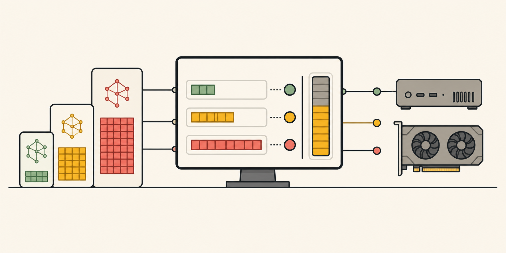

# OnDesk

> What fits on the desk. Not in the cloud.



OnDesk helps you choose local AI hardware with fewer guesses. Pick a GPU or
Apple Silicon configuration to see which models fit, or paste a Hugging Face
repository to find the hardware that can run it.

Every result shows the memory estimate, best available quantization, fit band,
and estimated generation speed. The calculations are deterministic and visible
instead of being delegated to an AI model.

## Try OnDesk

### Use the web app

Open the [live demo](https://ondesk.webmap-directory.workers.dev) and test
OnDesk immediately—no installation or account required. Choose your hardware
from the catalog, then explore compatible models or search in the opposite
direction from model to hardware.

### Run it on your device

Running OnDesk locally enables host hardware detection in addition to the full
web experience. Requirements: Node.js 20 or newer.

```bash
git clone https://github.com/hex41434/OnDesk.git
cd OnDesk
npm install
npm test
npm run dev
```

Open [http://localhost:3000](http://localhost:3000).

Other useful commands:

```bash
npm run typecheck
npm run build
```

## What OnDesk does

- **Hardware to models:** choose a device and get a ranked list of compatible
  language, vision, detection, segmentation, speech, and embedding models.
- **Model to hardware:** paste an `org/model` identifier or Hugging Face URL and
  see the smallest compatible hardware in the catalog.
- **Inference and training modes:** compare normal inference with a conservative
  full-training memory estimate.
- **Transparent memory math:** inspect weights, KV cache, runtime overhead, extra
  modality memory, and usable device memory.
- **Practical filters:** narrow results by task, model name, hardware name,
  memory use, fit quality, quantization, or estimated speed.
- **Optional smart search:** Gemini improves the search experience by translating
  informal or multilingual queries into hardware and Hugging Face search terms.
  It is not required and never decides the fit score.

## Deploy to Cloudflare Workers

The full-stack app deploys through OpenNext. A custom domain is optional;
Cloudflare provides a `*.workers.dev` URL automatically.

```bash
npm run build:cf
npm run deploy
```

Host hardware detection remains local-only. Public visitors choose their
hardware from the catalog instead of reading the Cloudflare server runtime.

## Optional Gemini search

OnDesk works without Gemini: local catalog matching and direct Hugging Face Hub
search remain available. Gemini is an optional search-quality enhancement for
natural-language queries. To enable it, either save a Gemini API key on the
**Settings** page or create `apps/web/.env.local`:

```bash
GEMINI_API_KEY=your_key_here
```

A key entered through Settings is stored in that browser's local storage and is
sent to the OnDesk API only when smart search is used. Fit calculations remain
inside `@ondesk/core` and do not use Gemini.

## How scoring works

At a high level, OnDesk estimates:

```text
working set = model weights + KV cache + runtime overhead + modality extras
```

The scorer then compares the working set with usable VRAM or unified memory,
selects the highest-quality supported quantization that fits, and assigns one
of four bands:

- `perfect` — uses at most 50% of available memory
- `good` — uses at most 75%
- `tight` — uses at most 90%
- `no` — does not fit under the current assumptions

Estimated tokens per second use memory bandwidth and a hardware-specific
efficiency factor. They are always labeled `est.` because they are projections,
not benchmark results. The full formulas and assumptions are available at
[`/about`](http://localhost:3000/about) while the app is running.

## Project structure

```text
apps/web/              Next.js application and API routes
packages/core/         deterministic fit and ranking engine
packages/core/test/    scoring and catalog tests
data/gpus.json         curated hardware profiles
data/models.json       curated model catalog
data/digest.json       digest source data
```

The main API is intentionally small:

```ts
fit(model, hardware, options)
// => { band, gb, quant, note, tokensPerSec, breakdown }
```

## Current limitations

- Hardware and catalog specifications are curated and may lag new releases.
- Speed values are estimates, not measurements from the selected device.
- Training mode models full training at roughly 6× FP16 weights; LoRA and QLoRA
  are not modeled yet.
- Remote Hugging Face repositories may not expose enough metadata for a reliable
  estimate.
- Host hardware detection is intended for local development and is not used to
  identify visitors' devices on a public deployment.

## License

[MIT](LICENSE)
